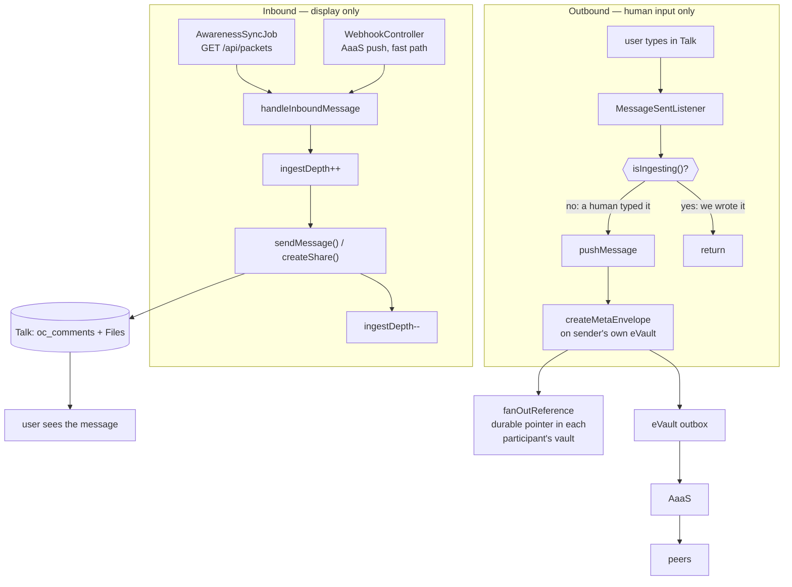

# Architecture: inbound sync via Awareness as a Service

Status: **implemented** in 0.7.2.

## Decision

Two paths with one job each, separated by construction:

- **Inbound** reads messages from AaaS and writes them into Talk for display.
  It ends there.
- **Outbound** fires only on human input and writes to the sender's own eVault.

Nextcloud stops reading eVaults to discover messages, and stores no message
content of its own.

## The architecture



**Inbound ends at the Talk database.** It writes what the user sees and stops.
It never reaches an eVault, because the message is already in one.

**Outbound starts at human input.** We write to the sender's own vault; the
outbox and AaaS handle delivery. The reference fan-out continues alongside it,
giving each participant a durable pointer in their own vault — written, never
read back by us.

**Invariant: an inbound message is never pushed outbound.** Not "usually not",
not "unless a cache expired". Never.

## Why the paths need separating at all

Both are correct in isolation. Inbound **must** call `sendMessage()` — that is
the only API Talk offers for putting a message in a room, so without it an
inbound message is invisible. Outbound **must** listen for that event — that is
how a typed message is detected.

They meet at Talk's storage, and Talk raises the same event for both writes
without saying who caused it. The inbound path therefore re-enters the outbound
path *through Talk*.

### The guard

`sendMessage()` and `createShare()` are synchronous and in-process, so the
listener always fires inside our own call stack. This is **re-entrancy**, not a
distributed problem:

```php
// ChatSyncService
private int $ingestDepth = 0;

public function isIngesting(): bool {
    return $this->ingestDepth > 0;
}

// wrap every Talk write on the inbound path
$this->ingestDepth++;
try {
    $chatManager->sendMessage(...);   // or $shareManager->createShare(...)
} finally {
    $this->ingestDepth--;
}

// MessageSentListener, first line
if ($this->chatSyncService->isIngesting()) {
    return;
}
```

One counter on a shared service. No cache, no Redis, no TTL, no uid matching,
no DB row, no race. Depth rather than a bool because ingest can nest
(attachment inside a forward).

Keep `origin = 'inbound'` as a durable backstop for any listener firing outside
our stack, but **write it before** the Talk call so it is actually armed, and
backfill the comment ID once known.

### The four guards this replaces

| Guard | Why it does not hold |
|---|---|
| `isInboundPostActive` | Keyed `md5($senderUid\|$roomToken)` on the *original sender*, but the echo is pushed under the *recipient's* uid. For any message from another person the key never matches. |
| `getOrigin() === 'inbound'` | Written at line 1068, *after* `sendMessage()` at line 1049. The listener has already run and returned. |
| `share:<id>` join | Written at line 1017, *after* `createShare()`. Same ordering flaw. |
| `isSyncLocked` | Keyed on a comment ID that does not exist yet. |

All four need the result of a call that has not returned. The counter needs
nothing.

Consequence at HEAD: an inbound attachment is re-sent as a new envelope under
the recipient's identity, to everyone in the room. `InitialSyncJob` →
`pullSyncForUser` walking all history on install is what scaled that to "every
image I ever shared". AaaS removes the history walk but not the loop, so this
guard is step 1 below, not a side effect of the migration.

## Why AaaS for inbound

Every eVault holds its own replica of a message, so listing vaults surfaces the
same message once per participant. All of this exists to repair that:
`messageIdentitySignature`, `message_sig`, `message_occ`, `w3ds_sync_cursors`,
`PruneEchoedMessagesCommand`.

The design was there from `4ec3a9a` (#1) — `pollRoom`, `pullSyncForUser`,
`PollController`, `talk-poller.js`, `PullSyncJob`, `SyncCursor` all shipped on
day one. Later PRs paid its cost:

| Commit | `ChatSyncService` lines |
|---|---|
| `4ec3a9a` #1 | 1009 |
| `5e8139a` #11 fan out to every participant | 1108 |
| `f11606e` paginate + cross-replica dedup | 1289 |
| `502e9fe` #33 forwards + attachments | 2352 |

The PRs did not break the architecture, they exposed it. AaaS should have been
the inbound path from the start.

## What AaaS provides

Verified against the live service at `https://aaas.w3ds.metastate.foundation`
(`GET /openapi.json`), not just the prose docs. **Four deviations from the
documentation matter:**

1. **The packet field is `ontology`, not `schemaId`.** The prose docs and the
   legacy webhook body both say `schemaId`; `GET /api/packets` returns
   `ontology`. Our reader must accept either.
2. **Packets carry `receivedAt`** in addition to `occurredAt`. Paging is by
   `receivedAt`.
3. **`eventId` may be synthetic.** Historical rows come back as
   `legacy-packet:<uuid>`, and their `streamVersion` is `null`. Dedup must not
   assume a real UUID or a usable version.
4. **`evaultPublicKey` and `w3id` are nullable.**

Confirmed working:

- `GET /api/packets?ontology=<csv>&evault=&from=&to=&limit=&cursor=`, bearer
  `aaas_…`. `limit` defaults to 100, **max 500**. Returns `packets`, `count`,
  `total`, `pageSize`, `totalPages`, `hasMore`, `nextCursor` (an opaque base64
  cursor over `{receivedAt,id}`).
- `GET /api/me` → consumer identity, `status`, and `webhookBaseUrl`.
- `POST /api/subscriptions` with `targetUrl` (defaults to
  `<consumer.webhookBaseUrl>/api/webhook`), `ontologyFilter`, `evaultFilter`,
  `secret`. `GET` / `PATCH` / `DELETE` for our own.
- `GET /api/me/deliveries`, `/health`, `/ready`, `/metrics`.
- `operation` is `create` | `update` | `delete`.

**Scale note.** The instance holds ~730k packets total, ~10.9k for a single
recent day, across every ontology in the ecosystem. Filtering by `ontology` is
not optional — an unfiltered cursor walk would take 364k requests at the
default page size. We filter to the Chat, Message and `w3ds-file-v1`
ontologies.

Identity semantics are as documented — see below.

### How messages are identified

Documented in the [Awareness
Protocol](https://docs.w3ds.metastate.foundation/docs/W3DS%20Protocol/Awareness-Protocol),
"Platform Contract → Idempotency", and it is prescriptive:

> Persist processed `eventId` values and acknowledge repeats without applying
> them twice. Do **not** deduplicate on `id`: create and later updates
> intentionally share the same MetaEnvelope id.

Three identifiers, three jobs:

| Field | Meaning | We use it for |
|---|---|---|
| `eventId` | globally unique per *mutation event* | "have I processed this delivery?" |
| `id` | MetaEnvelope ID, stable across create + updates | "which Talk comment is this?" |
| `streamVersion` | monotonic within one envelope's stream | ordering / staleness within that envelope |

So identity is fully answered by the protocol, and neither field alone is
enough. `id` tells us *which message*; `eventId` tells us *which delivery of
it*. An edit arrives as a new `eventId` with the same `id` and a higher
`streamVersion` — deduping on `id` would silently drop every edit.

**This requires a `processed_event` store we do not have.** The doc says
"persist processed `eventId` values", because at-least-once delivery means the
same event can arrive twice after a timeout or worker crash. Options:

- A fourth `entity_type` in `w3ds_id_mappings` (`event`), local_id =
  `eventId`, global_id = `eventId`. Reuses the unique index as the dedup
  primitive, exactly as `ingest_claim` does.
- Bounded retention: unlike the `message` mapping, these are only needed for
  the retry window (24h) plus a margin, so they can be swept.

**Correction to the ordering claim.** "Ordered by receive time" is only true
*per stream*: "One MetaEnvelope is ordered for one subscription. There is
intentionally no global order across independent envelopes." So we cannot
assume messages arrive in conversation order, and must keep stamping Talk
comments from `occurredAt` / `createdAt` rather than arrival order.

**Deletes exist too.** `operation: "delete"` arrives as a tombstone with
`data: null`. We currently have no delete path at all; inbound deletes are
silently ignored. Worth deciding explicitly rather than by omission.

**Privacy note, stated plainly in the docs.** "The entire payload is sent in
plain text to any registered platform, so all data is sent to every platform."
Granular subscription by ontology is the current mitigation, with
by-reference delivery promised in a future version. This is a protocol-level
property we inherit, not something we can fix locally, but it should inform how
much we put in a message payload.
## Outbound stays as it is

AaaS has no write path. `createMetaEnvelope` on the **sender's own eVault** over
GraphQL, `X-ENAME` identifying the owner. The eVault commits an awareness outbox
event in the same Neo4j transaction, a dispatcher retries `POST
AWARENESS_SERVICE_URL/ingest` until AaaS acknowledges, and AaaS matches
subscriptions, excludes the requesting platform, and delivers to peers.

**`fanOutReference` stays.** It is tempting to argue AaaS delivery makes the
per-participant `reference` envelope redundant, but the Web3 Adapter docs
describe both, side by side: after `storeMetaEnvelope`, "if `participants`
includes other eNames, adapter may call `storeReference(ownerEvault/globalId,
otherEvault)` for each." They serve different consumers:

| Mechanism | Serves |
|---|---|
| Awareness packet | platforms reacting to a live event |
| `reference` envelope | anything reading a user's vault as their data store |

A participant's eVault is meant to *be* their data. Someone who joins later,
migrates platform, or inspects their vault directly should find the
conversation there. Dropping the fan-out is irreversible for messages already
sent, on a contract we do not own.

So we keep it and accept the N-1 writes per message. What we stop is *reading*
those references.

Three defects to fix while here:

- **Legacy API.** `storeReference` calls `storeMetaEnvelope`, which the docs
  list as legacy in favour of `createMetaEnvelope`. Audit `EvaultClient`'s other
  calls for the same.
- **`acl: ["*"]` is world-readable.** Not the message body, but still metadata
  about who is talking to whom, published publicly. `_acl` — grants with
  READ/CREATE/UPDATE/DELETE bitmasks — is the current model and takes
  precedence. Note the forward-only warning: once records carry `aclBlock`, a
  rollback reads the legacy array instead and re-exposes them.
- **Dedup by `eventId`, branch on `operation`.** Delivery is explicitly
  at-least-once, and `operation` (`create` / `update`) is on the packet, rather
  than inferring from whether a mapping exists.

## Cross-platform compatibility: what the ontology actually allows

Browsed <https://ontology.w3ds.metastate.foundation/> — 64 schemas across 20
domains. The two that matter to us are in domain `communication`, and both set
`additionalProperties: false`.

### `Message` — `550e8400-…-446655440004`

```
properties: id, chatId, senderId, content, type, mediaUrl,
            readBy, createdAt, updatedAt, isArchived
required:   id, chatId, senderId, content, type, createdAt
type enum:  text | image | file | system
```

Five fields we send are not in the schema:

| Field we send | Purpose |
|---|---|
| `senderEName` | stable eName alongside the envelope-ID `senderId` |
| `isSystemMessage` | redundant with `type: "system"` |
| `fileId` | `w3ds://file` URI |
| `file{name,size,mimeType}` | attachment metadata |

(`forwardedFrom` is also outside the schema, but we only ever read it — see
below.)

So the honest answer to "do other platforms support this?": **only
`mediaUrl`.** A conforming consumer sees one attachment field, not our richer
pair, and a strict validator may reject the envelope. This is why
`pushAttachment` already prefers `publicUrl` for `mediaUrl` — that fallback is
the only part of our attachment representation guaranteed to render elsewhere.

Forwards are a different case, and not a problem. Nextcloud Talk has no forward
feature, so we never *write* `forwardedFrom` — grep confirms it is read-only in
`resolveForwardedMessage`, `attributeForward` and `localCommentForForward`. It
exists so that a forward composed on **Meshenger** renders correctly here,
which is what #33 added. Inbound-only consumption of a field a peer chose to
send costs nothing and breaks nobody; if the field is absent we fall through to
ordinary text. Leave as is.

`readBy` is the reverse case — a schema field we never populate, so read
receipts from other platforms are silently discarded.

### `Chat` — `550e8400-…-446655440003`

```
properties: id, name, type, participantIds, lastMessageId,
            createdAt, updatedAt, isArchived
required:   id, type, participantIds, createdAt
```

We send `admins`, which is **not** in the schema, and we deliberately omit
`type` — which **is required** — to work around a blabsy adapter crash (see the
comment at line 297). So our Chat envelopes are non-conforming in both
directions: an extra field, and a missing required one.

### `File` — `a1b2c3d4-…` (domain `storage`)

A full file type exists: `id, name, displayName, description, mimeType, size,
md5Hash, data, url, ownerId, folderId, createdAt, updatedAt`. We do not use it;
we use `uploadFile` and the `w3ds-file-v1` slug instead. Worth knowing the
alternative exists, though the AaaS docs specifically recommend subscribing to
`w3ds-file-v1` rather than mirroring blobs as `File` entities.

### `reference` is not a registered schema

`storeReference` writes `'ontology' => 'reference'` — a bare string, not a
W3ID. The registry has a `Reference` schema (`c20e9437-…`) but it is domain
`reputation`, a review/rating type with `numericScore` and `referenceType`,
entirely unrelated. So the fan-out pointer rides on an unregistered ontology
name. It works because it is a private convention between platforms using the
same adapter, but no schema governs it.

### What the docs say to do

> If no schema fits what you are modelling, the correct move is to propose a
> new one. [...] extending a near match by PR beats creating a parallel type.

And on the risk of not doing so:

> An invented `schemaId` does not fail loudly. [...] every receiving platform
> finds no mapping for that schema and drops it.

So the correct path is a PR against `services/ontology/schemas/` extending
`Message` with attachment metadata, and resolving the `Chat.type` conflict
properly rather than by omission. Until that merges, treat everything outside
the schema as best-effort decoration and make sure a message still makes sense
with only schema fields present.

None of this blocks the AaaS migration — transport and payload shape are
independent — and none of it is urgent. Logged for a later pass; the attachment
fields are the only ones we actually depend on cross-platform.

## Changes

**Add.** `AwarenessClient` (packets + subscriptions). `AwarenessSyncJob`
(TimedJob 60s, one instance cursor in appconfig). HMAC verification in
`WebhookController`. The re-entrancy guard.

**Delete.**

| Removed | Replaced by |
|---|---|
| `pollRoom`, `pullSyncForUser` | AaaS packet stream |
| `PullSyncJob`, `InitialSyncJob` | — |
| `PollController`, `talk-poller.js` | — |
| `isInboundPostActive`, `inbound_post` | the depth counter |
| `messageIdentitySignature`, `message_sig`, `message_occ` | `eventId` + `id`, per the protocol contract |
| `w3ds_sync_cursors`, `SyncCursor(Mapper)` | appconfig cursor |

`InitialSyncJob` goes entirely, including its outbound half: `pushMessage` calls
`ensureChatSynced` (line 478), which creates the Chat envelope on first message
anyway. The job only changes *when* that happens, and only matters for rooms
nobody speaks in again. It also stamps `createdAt` as link time and pushes
degraded participant lists when `ParticipantService` fails.

**Keep.** `w3ds_id_mappings` chat/message rows and `origin`. `ingest_claim` push
claims. The outbound write path, its ACL, and `fanOutReference`.

## What the database holds afterwards

| Table | Purpose | Change |
|---|---|---|
| `w3ds_login_mappings` | W3ID ↔ NC uid, the account link | none |
| `w3ds_tentative_users` | lazily provisioned accounts, TTL-swept | none |
| `w3ds_id_mappings` | local↔global ID join | rows removed, see below |
| `w3ds_sync_cursors` | per-user, per-ontology poll cursors | **dropped** |

`w3ds_id_mappings` keeps three `entity_type` values, gains one, loses three:

- **Keep `chat`, `message`** — Talk room token ↔ Chat envelope ID, Talk comment
  ID ↔ Message envelope ID, plus `origin`. This join exists nowhere else; losing
  it means re-posting every inbound message as a duplicate.
- **Keep `ingest_claim`** — row lock so two requests do not ingest the same
  envelope concurrently. Mutual exclusion with a TTL, released on completion.
  It answers "is someone ingesting this right now?", **not** "was this already
  processed?" — different questions, different rows.
- **Add `awareness_event`** — claimed `eventId` values, as the protocol
  requires. This answers "have I applied this delivery?" under at-least-once
  delivery, and the unique index decides the race rather than a read-then-write.
  Released on failure so a transient error is retried on redelivery.
- **Drop `inbound_post`** — replaced by the depth counter.
- **Drop `message_sig`, `message_occ`** — they exist because per-vault *listing*
  surfaced the same message once per participant. References still sit in peers'
  vaults, but we no longer read them: one inbound path, one packet per message,
  deduped by `eventId` (delivery) and the `message` mapping (entity).

The AaaS cursor lives in appconfig: one opaque string for the instance.

So: **no message content, no sender, no timestamps, no attachment metadata.**
Bodies live in the eVault, attachment bytes land in the recipient's Files as
ordinary Nextcloud files, and we store only identifiers pointing at them.

Talk continues to store the conversation itself in `oc_comments`, `oc_talk_*`
and the Files tables, exactly as it always has. That is Talk's job, and it is
what makes messages visible at all.

## Tests that must drive the real ordering

`testTheInFlightGuardOutlastsALargeDownload` only asserts a constant is ≥600. It
never exercises the echo path, so a green suite says nothing. Replace with:

| Case | Expected |
|---|---|
| inbound text message | no outbound envelope |
| inbound attachment (`createShare` echo) | no outbound envelope |
| inbound forward | no outbound envelope |
| **local message, same room, same second** | **is pushed** |

The last one is the point. The current per-room 600s guard silently swallows a
genuine local message sent while an ingest is in flight, so "no echo" must not
become "no sync".

## Features that must keep working

Verified against the design, all from #31/#33:

- **Forwards from Meshenger.** Inbound-only: Talk has no forward feature, so we
  read `forwardedFrom` and never write it. `resolveForwardedMessage` fetches the
  original by ID (`fetchMetaEnvelopeById`), not by listing, so it is untouched.
  Improves: packets are retried for 24h.
- **Attachment upload.** `pushAttachment` → `uploadFile` → `mediaUrl` /
  `publicUrl` / `file{}`. Outbound is unchanged. Subscribe to `w3ds-file-v1`
  verbatim — it is a slug, not a UUID.
- **Attachment display.** `pickAttachmentUri` handles `w3ds://file`, https and
  `data:`; sniffing, extension repair, caption dedup all local. Unaffected by
  the transport, but depends on the step-1 guard to stop echoing.

## Sequence

Shipped in this order:

1. **Separate the paths.** The re-entrancy guard, `origin` writes before the
   Talk calls, `isInboundPostActive` and `inbound_post` deleted. Merged on its
   own because it fixes a live leak independently of anything else.
2. `AwarenessClient` + config + admin settings.
3. `AwarenessSyncJob` and `AwarenessPacketProcessor`, with the webhook routed
   through the same processor.
4. Poll paths, poller JS, `InitialSyncJob` and `PullSyncJob` removed.
5. Signature machinery removed.
6. Migration `Version000800` drops `w3ds_sync_cursors` and sweeps
   `message_sig` / `message_occ` / `inbound_post`.

### Verified against the live service

Run against `https://aaas.w3ds.metastate.foundation` on a real Nextcloud 33:

- Ontology filter and cursor paging work; consecutive pages do not overlap.
- 2000 packets consumed, each claimed exactly once. Replaying the same window
  after rewinding the cursor added **zero** rows, so at-least-once delivery is
  handled.
- Webhook accepts a correct signature, rejects a forged one, a missing one, and
  a tampered body.
- Migration leaves exactly three tables; `w3ds_sync_cursors` is gone.
- `AwarenessSyncJob` is registered and `PullSyncJob` is not.

One bug was found this way and only this way: the job stored no cursor on a
quiet poll, and re-derived its starting timestamp as "now" each run, so packets
arriving between two runs were never requested. The starting point is now
recorded once, with a test driving that case.

## Open questions

1. ~~Do we have an approved AaaS consumer and API key?~~ Yes, verified against
   the live service.
2. ~~What base URL?~~ `https://aaas.w3ds.metastate.foundation`, configured per
   instance rather than defaulted.
3. Does one logical message yield exactly one packet? Still unconfirmed for the
   reference case, but no longer load-bearing: dedup is by `eventId` as the
   protocol specifies, not by content.
4. Confirm the fan-out stays. The adapter docs say "may call `storeReference`";
   if a future version drops it for pure awareness delivery, revisit.
5. ~~Keep `WebhookController` as the fast path?~~ Kept; both routes share one
   processor.
6. Confirm Talk dispatches `ChatMessageSentEvent` / `SystemMessageSentEvent`
   synchronously on every supported version. The guard depends on it; the
   durable `origin` marker covers a queued dispatch.
7. What do we do with `operation: "delete"` tombstones? Currently logged and
   ignored, deliberately: deleting someone's message on a remote instruction is
   irreversible and easy to abuse.
8. Do we handle edits? An `update` reaches `handleInboundMessage`, but it does
   not rewrite an existing comment, so remote edits still do not appear.
9. Later: do we PR the `Message` schema to add the attachment fields we send
   (`fileId`, `file{}`), and `Chat` for `admins`? Related: does any eVault
   validate `additionalProperties: false` on write, or is it advisory today?
10. Later: `Chat.type` is required by the schema but we omit it to avoid a
    blabsy adapter crash. Fix upstream, or send it and accept the breakage?

## Growth and retention

`w3ds_id_mappings` gains one row per message, forever, while Talk prunes
`oc_comments` on some configurations. Unbounded divergence. Needs a retention
policy tied to Talk's before this ships at scale — out of scope for the
migration itself, but it should not be forgotten.
