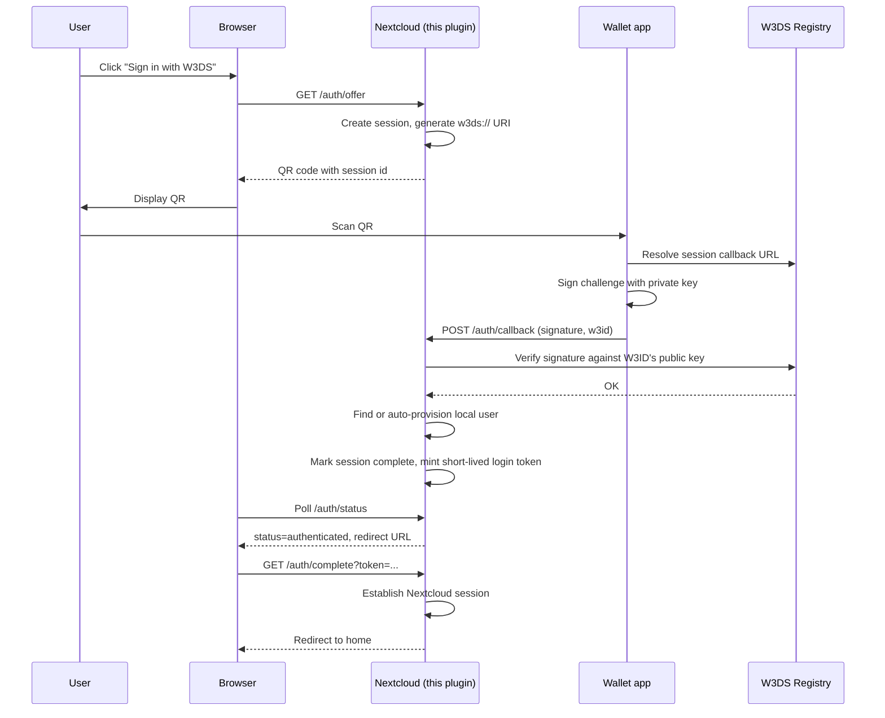
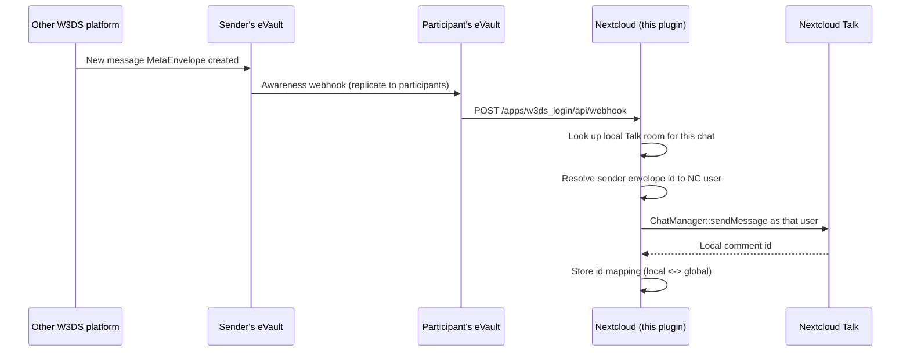
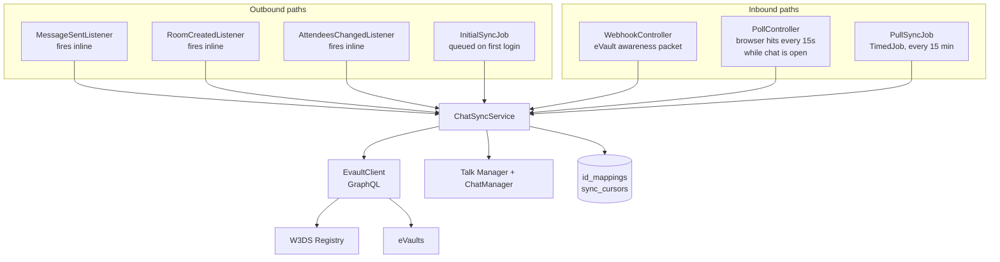

# How it works

This plugin does two things. It lets people log in to Nextcloud with a W3DS wallet instead of a password, and it syncs Nextcloud Talk chats with the user's eVault so chats stay consistent across every W3DS-connected platform.

The two halves are independent. You can use the login without Talk sync, or vice versa, but both rely on the same plumbing for resolving a W3ID to an eVault URL via the W3DS Registry.

## The pieces

There are three external systems the plugin talks to:

- **The user's wallet app**. Holds the private key. Signs login challenges and approves chat sync.
- **The W3DS Registry**. Maps a W3ID like `@alice` to the URL of that user's eVault. Also issues a platform certification token so eVaults trust requests coming from this Nextcloud instance.
- **The user's eVault**. A GraphQL service that stores MetaEnvelopes (typed structured records). For chat sync we use two schemas: `Chat` and `Message`. The eVault also fans out webhooks to other platforms when something changes.

Inside Nextcloud, the plugin adds:

- A login provider that drops a "Sign in with W3DS" button on the login page.
- Talk event listeners that push outbound chat changes to the user's eVault.
- A webhook endpoint at `/apps/w3ds_login/api/webhook` that receives inbound notifications from eVaults.
- A frontend poller that hits the per-room poll endpoint every 15 seconds while a chat is open. This is what makes inbound messages feel real-time without depending on cron.
- Background jobs that backfill on first link and run a slower pull sync every 15 minutes as a safety net.

## Login flow

A few notes on this flow:

- The session id and login token are kept in the distributed cache, not the database. Sessions live for 5 minutes, login tokens live for 1 minute. Tight TTLs because nothing here should hang around.
- Auto-provisioning creates a local Nextcloud user the first time a new W3ID logs in. That mapping is stored in `oc_w3ds_login_mappings` so subsequent logins resolve straight to the same local account.
- Account linking (linking an existing Nextcloud user to a W3ID without losing the password) reuses the same session machinery. The only difference is the session is created with an `ncUid` already attached, so `/auth/callback` knows to attach instead of provisioning.

## Chat sync, the high-level shape

The protocol assumes every participant of a chat owns a copy of the chat (and its messages) in their own eVault. Messages live across many replicas. Each replica has its own MetaEnvelope id but the same logical content. When something changes in one replica, that eVault sends webhooks to every other participant's eVault, and they push to the platforms those users are connected to.

So when a user sends a message in Nextcloud Talk:

1. Talk fires a `ChatMessageSentEvent`.
2. Our `MessageSentListener` catches it and calls `ChatSyncService::pushMessage`, inline. We don't queue this because Nextcloud cron only runs every 5 minutes and that's way too slow for chat. The listener does add ~1 to 2 seconds to the Talk HTTP response which is the price for not being slow.
3. `pushMessage` resolves the user's eVault URL via the Registry, then writes a Message MetaEnvelope.
4. The user's own eVault then fans out the change to other participants' eVaults via the W3DS awareness protocol.
5. Those eVaults POST our webhook endpoint, which posts the inbound message into the matching local Talk room.

Inbound from another platform is the mirror image of this:

## Three sync paths, one service

Everything routes through `ChatSyncService`. There are three ways data flows in or out, and they all share the same anti-ping-pong machinery so a webhook doesn't trigger an outbound listener that triggers another webhook.

Why three inbound paths instead of one? Each covers a different failure mode:

- **Webhooks** are the fast path. Sub-second latency when they work. But they get dropped if Nextcloud is down, if there's a network blip, or if a participant joined the chat after a message was sent.
- **The per-room poller** makes the chat feel live. The browser pings `/api/rooms/{token}/poll` every 15 seconds while a chat is open. The handler walks every linked participant of that room, fetches recent messages from each of their eVaults filtered by `chatId`, and posts anything new into the local Talk room. This is also the reason the cross-replica dedup signature exists, since each eVault holds a separate copy of the same logical message.
- **The pull sync job** is the slow safety net. Runs every 15 minutes via Nextcloud cron. Walks every linked user's eVault from where it left off (cursors are in `oc_w3ds_login_sync_cursors`) and catches anything the other two paths missed.

## Schema mapping

The plugin maps Talk's data model to the W3DS Chat and Message schemas. The mapping is in `ChatSyncService` and the gist is:

| Talk concept | W3DS field | Notes |
|---|---|---|
| Room token | (local id only, never sent) | Token stays local, kept in `id_mappings` |
| Room type 1 (one-to-one) | `type: "direct"` | Anything else maps to `"group"` |
| Room participants (NC UIDs) | `participantIds` | Each NC UID is resolved to a W3ID, then to a User profile envelope id |
| Room name | `name` | Direct copy |
| Comment id | (local id only) | Stays local |
| `actor_id` | `senderId` | Same NC UID to W3ID to envelope id chain as participants |
| `message` | `content` | Direct copy |
| `verb` | `type` | "comment" maps to "text", "system" maps to "system" |
| `creation_timestamp` | `createdAt` | ISO 8601 |

The reason participantIds are profile envelope ids and not raw W3IDs is that the W3DS protocol expects entity references to be addressable as MetaEnvelope ids on the owning eVault. The plugin caches the W3ID to envelope id mapping in both directions so reverse lookups during inbound handling don't need an extra Registry hit.

## Anti ping-pong

The dangerous case: a webhook delivers a message, we post it into Talk, Talk fires `ChatMessageSentEvent`, our listener pushes it back to the user's eVault, which fans out, which comes back as another webhook. Without protection this is an infinite loop.

Three defenses, all in `ChatSyncService`:

1. **Sync locks**. When inbound creates a local entity (chat or message), we set a 10-second lock keyed on the local id. Outbound pushes check the lock first and bail.
2. **Inbound-post locks**. The `MessageSentListener` runs synchronously inside the call to `ChatManager::sendMessage`. So we set a sender-and-room scoped lock immediately before posting an inbound message, and the listener checks that lock and returns early. This is independent of the message-id sync lock because we don't know the local message id until after `sendMessage` returns.
3. **Cross-replica dedup**. The polling path can pull the same logical message from multiple participants' eVaults under different global ids. We compute a content signature (`md5(senderUid + chatGlobalId + content)`) and stash it in cache for 24 hours. When a second replica of the same message arrives, we record its id in the mapping table but skip posting it to Talk.

## Database

Two app-owned tables on top of Nextcloud's standard ones:

- `oc_w3ds_login_mappings`. NC UID to W3ID. Created at first login or first link.
- `oc_w3ds_login_id_mappings`. Local Talk id (room token or comment id) to global eVault MetaEnvelope id. Indexed by both directions.
- `oc_w3ds_login_sync_cursors`. Pagination cursor per user per schema, used by `PullSyncJob` so we don't refetch the whole eVault every run.

## What can go wrong

- **Talk read fails during a participant change**. The `AttendeesChangedListener` re-pushes the chat by reading the live participant list from Talk. If `ParticipantService::getParticipantsForRoom` throws (which happens during certain Talk lifecycle events), the read returns an empty list, and without protection the chat in eVault would get overwritten with just the owner. The fix is in `pushChat`: if we already have an eVault id for this chat AND the local read returned zero participants, we abort the update.
- **Webhook bursts**. Cross-replica messages can arrive at the webhook endpoint nearly simultaneously. The dedup signature makes this safe but the side effect is that only one of them will be posted to Talk. This is intentional.
- **Talk not installed**. Every Talk-touching code path is guarded by `class_exists`. The plugin still works for login if Talk isn't there. Sync code paths just no-op.
