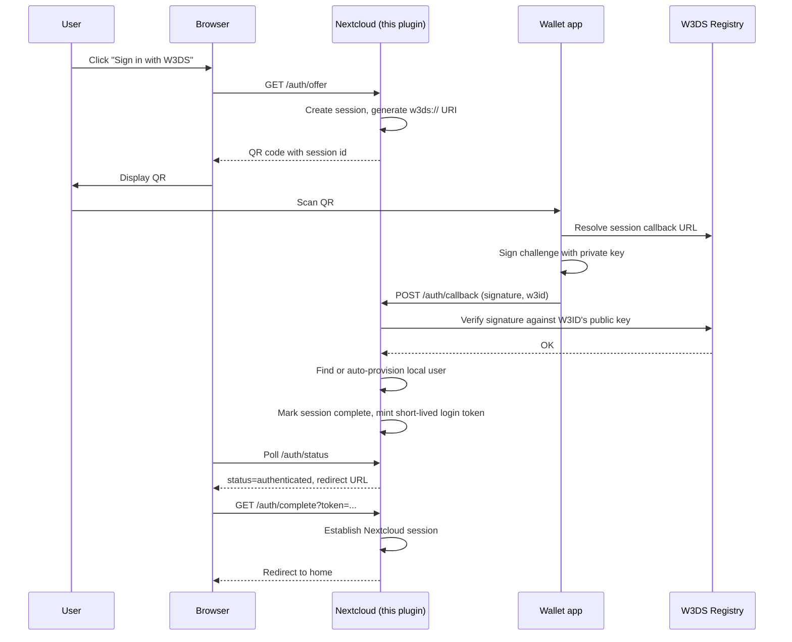
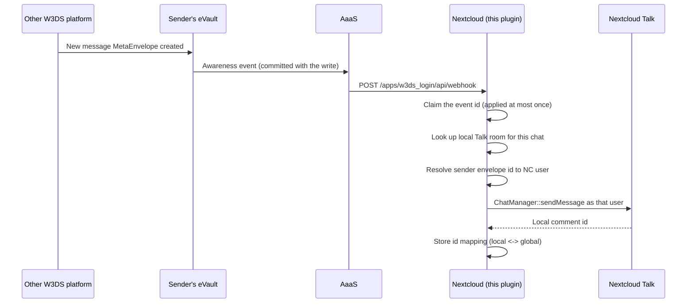
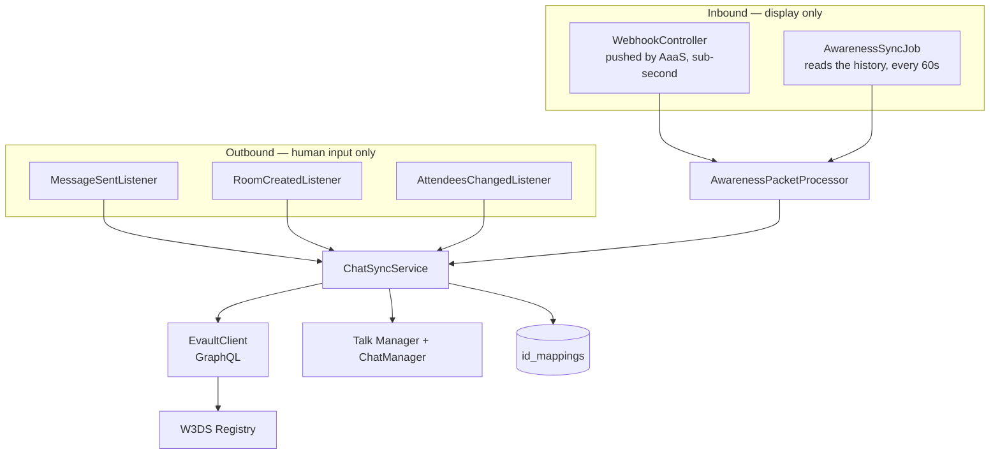

# How it works

This plugin does two things. It lets people log in to Nextcloud with a W3DS wallet instead of a password, and it syncs Nextcloud Talk chats with the user's eVault so chats stay consistent across every W3DS-connected platform.

The two halves are independent. You can use the login without Talk sync, or vice versa, but both rely on the same plumbing for resolving a W3ID to an eVault URL via the W3DS Registry.

## The pieces

There are three external systems the plugin talks to:

- **The user's wallet app**. Holds the private key. Signs login challenges and approves chat sync.
- **The W3DS Registry**. Maps a W3ID like `@alice` to the URL of that user's eVault. Also issues a platform certification token so eVaults trust requests coming from this Nextcloud instance.
- **The user's eVault**. A GraphQL service that stores MetaEnvelopes (typed structured records). For chat sync we use two schemas: `Chat` and `Message`. Every write also commits an awareness event beside the data.
- **Awareness as a Service (AaaS)**. The single fanout point for those events. It holds a queryable history and delivers to the platforms that subscribe, which is how this plugin learns that anything happened.

Inside Nextcloud, the plugin adds:

- A login provider that drops a "Sign in with W3DS" button on the login page.
- Talk event listeners that push outbound chat changes to the user's eVault.
- A webhook endpoint at `/apps/w3ds_login/api/webhook` that receives awareness packets pushed by AaaS.
- A background job that reads the same packets from the AaaS history, so a missed delivery is caught up rather than lost.
- Background jobs that backfill on first link and run a slower pull sync every 15 minutes as a safety net.

## Login flow

```mermaid
sequenceDiagram
    participant U as User
    participant B as Browser
    participant NC as Nextcloud (this plugin)
    participant W as Wallet app
    participant R as W3DS Registry

    U->>B: Click "Sign in with W3DS"
    B->>NC: GET /auth/offer
    NC->>NC: Create session, generate w3ds:// URI
    NC-->>B: QR code with session id
    B->>U: Display QR
    U->>W: Scan QR
    W->>R: Resolve session callback URL
    W->>W: Sign challenge with private key
    W->>NC: POST /auth/callback (signature, w3id)
    NC->>R: Verify signature against W3ID's public key
    R-->>NC: OK
    NC->>NC: Find or auto-provision local user
    NC->>NC: Mark session complete, mint short-lived login token
    B->>NC: Poll /auth/status
    NC-->>B: status=authenticated, redirect URL
    B->>NC: GET /auth/complete?token=...
    NC->>NC: Establish Nextcloud session
    NC-->>B: Redirect to home
```

A few notes on this flow:

- The session id and login token are kept in the distributed cache, not the database. Sessions live for 5 minutes, login tokens live for 1 minute. Tight TTLs because nothing here should hang around.
- Auto-provisioning creates a local Nextcloud user the first time a new W3ID logs in. That mapping is stored in `oc_w3ds_login_mappings` so subsequent logins resolve straight to the same local account.
- Account linking (linking an existing Nextcloud user to a W3ID without losing the password) reuses the same session machinery. The only difference is the session is created with an `ncUid` already attached, so `/auth/callback` knows to attach instead of provisioning.

## Chat sync, the high-level shape

The protocol gives every participant of a chat a copy in their own eVault: the author holds the message envelope, everyone else holds a reference to it. So when a user sends a message in Nextcloud Talk:

1. Talk fires a `ChatMessageSentEvent`.
2. Our `MessageSentListener` catches it and calls `ChatSyncService::pushMessage`, inline. We don't queue this because Nextcloud cron only runs every 5 minutes and that's way too slow for chat. The listener does add ~1 to 2 seconds to the Talk HTTP response which is the price for not being slow.
3. `pushMessage` resolves the user's eVault URL via the Registry, then writes a Message MetaEnvelope and a reference into each participant's vault.
4. That write commits an awareness event alongside the data. The eVault hands it to AaaS, which delivers it to every subscribed platform except the one that made the write.

Inbound is the mirror image, and it is where the architecture changed. We do not read anyone's eVault to discover messages; we are told:

```mermaid
sequenceDiagram
    participant Other as Other W3DS platform
    participant E as Sender's eVault
    participant A as AaaS
    participant NC as Nextcloud (this plugin)
    participant Talk as Nextcloud Talk

    Other->>E: New message MetaEnvelope created
    E->>A: Awareness event (committed with the write)
    A->>NC: POST /apps/w3ds_login/api/webhook
    NC->>NC: Claim the event id (applied at most once)
    NC->>NC: Look up local Talk room for this chat
    NC->>NC: Resolve sender envelope id to NC user
    NC->>Talk: ChatManager::sendMessage as that user
    Talk-->>NC: Local comment id
    NC->>NC: Store id mapping (local <-> global)
```

Reading one stream instead of many vaults is what removed the hardest problem in this plugin. Polling per participant returned the same logical message once per participant, each under a different envelope id, so the app had to decide by comparing message content whether two sightings were one message or someone genuinely saying "ok" twice. A packet carries an `eventId` that answers this exactly.

## Two paths, one service

Everything routes through `ChatSyncService`, and the two directions have one job each.

```mermaid
flowchart TB
    subgraph Outbound["Outbound — human input only"]
        L1[MessageSentListener]
        L2[RoomCreatedListener]
        L3[AttendeesChangedListener]
    end

    subgraph Inbound["Inbound — display only"]
        WH[WebhookController<br/>pushed by AaaS, sub-second]
        AJ[AwarenessSyncJob<br/>reads the history, every 60s]
    end

    L1 --> CSS[ChatSyncService]
    L2 --> CSS
    L3 --> CSS
    WH --> APP[AwarenessPacketProcessor]
    AJ --> APP
    APP --> CSS

    CSS --> EV[EvaultClient<br/>GraphQL]
    CSS --> Talk[Talk Manager + ChatManager]
    CSS --> DB[(id_mappings)]
    EV --> R[W3DS Registry]
```

Both inbound routes carry the same packets and go through the same processor, so the same event arriving twice is expected rather than a bug:

- **The webhook** is the fast path, sub-second, and needs a publicly reachable URL. Verified against the subscription secret when one is configured.
- **The job** reads the same history from a stored cursor. It is the backstop after downtime, and the whole inbound path on an instance AaaS cannot reach.

Delivery is at-least-once by design, so the processor claims each `eventId` once before applying it. Note that it deduplicates on the event, never on the MetaEnvelope id: a create and its later edits share that id, so keying on it would silently discard every edit.

## Schema mapping

The plugin maps Talk's data model to the W3DS Chat and Message schemas. The mapping is in `ChatSyncService` and the gist is:

| Talk concept | W3DS field | Notes |
|---|---|---|
| Room token | (local id only, never sent) | Token stays local, kept in `id_mappings` |
| Room type 1 (one-to-one) | `type: "direct"` | Anything else maps to `"group"` |
| Room participants (NC UIDs) | `participantIds` | Each NC UID is resolved to a W3ID, then to a User profile envelope id |
| Room name | `name` | Direct copy |
| Comment id | (local id only) | Stays local |
| `actor_id` | `senderId` | Same NC UID to W3ID to envelope id chain as participants |
| `message` | `content` | Direct copy |
| `verb` | `type` | "comment" maps to "text", "system" maps to "system" |
| `creation_timestamp` | `createdAt` | ISO 8601 |

The reason participantIds are profile envelope ids and not raw W3IDs is that the W3DS protocol expects entity references to be addressable as MetaEnvelope ids on the owning eVault. The plugin caches the W3ID to envelope id mapping in both directions so reverse lookups during inbound handling don't need an extra Registry hit.

## Keeping the two directions apart

The dangerous case: a packet delivers a message, we post it into Talk for display, Talk fires the same event it fires when a person types, our listener treats it as local input and pushes it back out as a new envelope under the recipient's identity, delivered to everyone in the room.

Both halves are correct on their own. Inbound *must* call `ChatManager::sendMessage`, because that is the only way to put a message in a room; outbound *must* listen for that event, because that is how a typed message is detected. The event simply carries nothing to say who caused it.

Since `sendMessage()` and `createShare()` are synchronous, the listener always fires inside our own call stack, so the question is answerable exactly rather than approximately:

- `ChatSyncService` counts how deep it is inside an inbound Talk write.
- `MessageSentListener` returns immediately when that depth is non-zero.

A counter rather than a flag because ingest nests: a forwarded attachment materialises a share while the forward is still being posted.

This replaced four guards that all read state written *after* the call that raised the event — the share mapping, the inbound origin marker, and two locks — so each was blind at the only moment it mattered. One of them was also keyed on the original sender's account while the echo is pushed under the recipient's, so it never matched for a message from another person, which is the ordinary case.

Two durable backstops remain, for events raised outside our stack:

- **Origin marking**. Inbound-created rows in `id_mappings` are marked `inbound`, and outbound refuses to replicate a mirror.
- **Share adoption**. An inbound attachment records the Talk share it created, so the comment Talk generates for that share is recognised rather than treated as new content.

## Database

Three app-owned tables on top of Nextcloud's standard ones:

- `oc_w3ds_login_mappings`. NC UID to W3ID. Created at first login or first link.
- `oc_w3ds_login_id_mappings`. Local Talk id (room token or comment id) to global eVault MetaEnvelope id, indexed both ways, plus the short-lived claim rows used for ingest locking and event deduplication.
- `oc_w3ds_login_tentative_users`. Accounts provisioned for someone who has not signed in yet, swept on a timer.

No message content is stored. Bodies live in the eVault, attachments land in the recipient's Files as ordinary files, and these tables hold only the correspondence between local and global identifiers. That correspondence is genuinely local knowledge: Talk knows nothing of eVaults, and a packet knows nothing of Talk, so without it every arriving message would look new and be posted a second time.

The AaaS cursor is a single value in appconfig. A position per user per ontology existed because there was a separate read per user per ontology; one stream needs one bookmark.

## What can go wrong

- **Talk read fails during a participant change**. The `AttendeesChangedListener` re-pushes the chat by reading the live participant list from Talk. If `ParticipantService::getParticipantsForRoom` throws (which happens during certain Talk lifecycle events), the read returns an empty list, and without protection the chat in eVault would get overwritten with just the owner. The fix is in `pushChat`: if we already have an eVault id for this chat AND the local read returned zero participants, we abort the update.
- **Duplicate deliveries**. The same event can arrive by webhook and by the polling job, or be resent after a timeout. This is the protocol working as specified, and the event claim makes it harmless.
- **No AaaS credentials**. Sending still works, because that writes to the sender's own eVault. Nothing arrives from other platforms until the service is configured with `occ` (see installation.md).
- **Talk not installed**. Every Talk-touching code path is guarded by `class_exists`. The plugin still works for login if Talk isn't there. Sync code paths just no-op.
